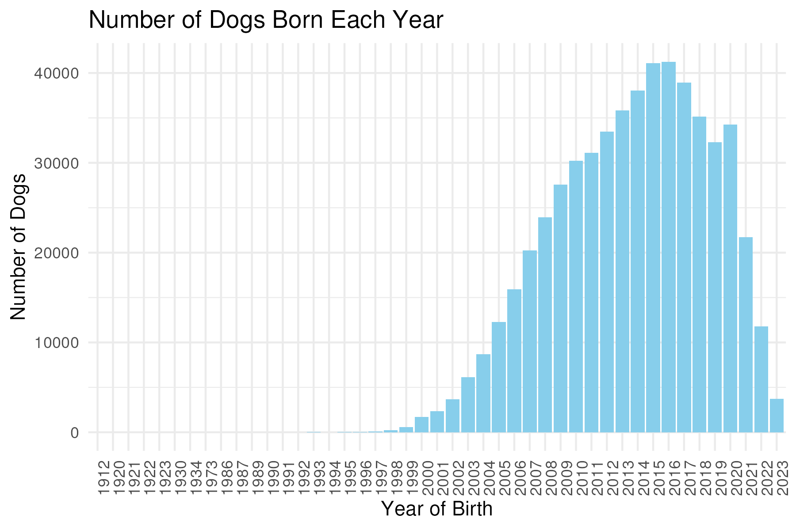

## Question 1

```{r}
message1 <- readLines("logs/logs_output1.txt")
cat(message1[1], sep = "\n")
```

## Question 2

```{r}
cat(message1[2], sep = "\n")
```

## Question 3

The first figure:

```{r, echo = FALSE}

```

The second figure:

```{r, echo = FALSE}

```

## Question 4

```{r}
cat(message1[3], sep = "\n")
```


## Question 5

```{r}
message2 <- readLines("logs/logs_output2.txt")
cat(message2[1], sep = "\n")
```

## Question 6

```{r, echo = FALSE}

```
